<style>
    body {
        font-size: 18px;
    }
</style>

# Evidence Pack
- [Evidence Pack](#evidence-pack)
- [1. Cover](#1-cover)
- [2. Data Access Pattern Log](#2-data-access-pattern-log)
- [3. Deployment Evidence](#3-deployment-evidence)
  - [Encryption in RDS](#encryption-in-rds)
  - [Multi-AZs RDS in RDS](#multi-azs-rds-in-rds)
  - [Security Groups in RDS](#security-groups-in-rds)
  - [Private subnets for RDS](#private-subnets-for-rds)
  - [Backups database](#backups-database)
  - [Snapshot](#snapshot)
  - [Instances and storages](#instances-and-storages)
  - [Database subnet group](#database-subnet-group)
  - [Disable public access](#disable-public-access)
- [4. Working Query Evidence](#4-working-query-evidence)
  - [JOIN operation](#join-operation)
  - [Indexing](#indexing)
- [5. Lambda, Textract and Comprehend Evidence](#5-lambda-textract-and-comprehend-evidence)
- [6. VPC and Networking Evidence](#6-vpc-and-networking-evidence)
- [7. Negative Security Test](#7-negative-security-test)

# 1. Cover
- Group number: 12
- Member names
  - Ngô Nguyên Phúc
  - Huỳnh Nguyễn Ngọc Tân
  - Tạ Hoàng Huy
  - Trương Công Tú
  - Trần Quang Minh
  - Nguyễn Minh Hoàng
  - Lý Ngọc Hiếu
  - Nguyễn Vũ Hoàng
  - Võ Văn Tuấn Anh
  - Nguyễn Trúc Quỳnh
- Selected Database: **RDS Postgres / Relational**


# 2. Data Access Pattern Log 
- **Part A** 
  - List available jobs by level (Candidate view): Retrieve job listings filtered by experience level (e.g., Senior, Mid, Junior), sorted by job creation time ( ~50 requests/min )
  - List of applications for a job (HR dashboard): Fetch all applications with job metadata (title, company) via JOIN, sorted by submission time ( ~20 requests/min at peak )
  - Application submission: Candidate submit a new application with their information, CV reference ( ~10 requests/min )

  
- **Part B**
  - List available jobs by level (Indexed Lookup)
    - Engine: RDS (PostgreSQL)
    - Paradigm: Relational database
    - Mechanism: B-tree index on `level` column. Without the index, Postgres performs a full sequential scan examining every row to find matching level values. With the index, Postgres uses an Index Scan to jump directly to matching rows, drastically reducing the number of rows examined — especially as the jobs table grows
        ```sql
            SELECT * FROM jobs WHERE level = $1 ORDER BY created_at DESC;
        ```
    - Index: CREATE INDEX idx_jobs_level ON jobs(level);

  - List of applications for a job (HR dashboard)
    - Engine: RDS (PostgreSQL)
    - Paradigm: Relational database
    - Mechanism: 
      - Foreign key `job_id` in `applications` table, referencing `id` in `jobs` table. PostgreSQL does not automatically index foreign key columns, so we explicitly create an index: `CREATE INDEX idx_app_job_id ON applications(job_id);` to speed up the JOIN lookup.
      - Using JOIN to fetch job name along with every application record. Without the index on `job_id`, Postgres scans the entire applications table for the JOIN, which is costly as the number of applications grows
        ```sql
            SELECT 
                a.id, 
                a.full_name, 
                a.email, 
                a.submitted_at, 
                a.status,
                j.title as job_title,
                j.company as job_company
            FROM applications a
            JOIN jobs j ON a.job_id = j.id
            ORDER BY a.submitted_at DESC
        ```

  - Application Submission (Candidate Submit Application)
    - Engine: RDS (PostgreSQL)
    - Paradigm: Relational database
    - Mechanism: 
      - Foreign key `job_id` in `applications` table, referencing `id` in `jobs` table. Foreign key constraint ensures referential integrity.
      - INSERT operation with RETURNING clause to confirm record insertion. Without foreign key constraint, invalid job_id could be inserted, corrupting data consistency. ACID ensures that the application record is completely written or fully rolled back when an error occurs
        ```sql
            INSERT INTO applications (job_id, full_name, email, phone, experience_summary, cv_s3_key)
            VALUES ($1, $2, $3, $4, $5, $6)
            RETURNING id;
        ```

- **Part C: Wrong Paradigm Test**


<table border="1" cellpadding="10" cellspacing="0" style="border-collapse: collapse; width: 100%;">
  <thead>
    <tr>
      <th style="text-align: left;">App type</th>
      <th style="text-align: left;">Data shape</th>
      <th style="text-align: left;">Engine + paradigm</th>
      <th style="text-align: left;">"Wrong-paradigm" test</th>
    </tr>
  </thead>
  <tbody>
    <tr>
      <td><strong>Recruitment System</strong></td>
      <td>List of available jobs filtered by level via <code>WHERE level = $1 ORDER BY created_at DESC</code> with 50 requests/min at peak</td>
      <td><strong>RDS PostgreSQL (relational)</strong></td>
      <td>DynamoDB requires every query pattern to be pre-designed as a GSI. A GSI with PK=level can serve this one filter, but adding new filters (e.g., location, salary range, job type) each requires a separate GSI — and DynamoDB limits tables to 20 GSIs. RDS PostgreSQL handles this flexibly with B-tree indexes: a single <code>CREATE INDEX</code> on any column enables filtered lookups, and composite indexes support multi-column WHERE clauses without redesigning the table. Additionally, DynamoDB does not support ORDER BY across partitions, so sorting results by created_at requires client-side merging.</td>
    </tr>
    <tr>
      <td><strong>Recruitment System</strong></td>
      <td>List of applications for a job (HR dashboard): Fetch application information along with jobs via foreign key constraint. Using JOIN to fetch all applications for a job including job metadata (title, company), sorted by submitted_at DESC
      </td>
      <td><strong>RDS PostgreSQL (relational)</strong></td>
      <td>DocumentDB does not support JOIN operation. It must embed job information into every application document. When job information is updated, all embedded records must be updated separately, leading time consuming and inconsistency.</td>
    </tr>
    <tr>
      <td><strong>Recruitment System</strong></td>
      <td>Application Submission (Candidate Submit Application): Insert application with foreign key constraint ensuring referential integrity. The RETURNING clause confirms record insertion. Without foreign key constraint, invalid job_id could be inserted, corrupting data consistency.
      </td>
      <td><strong>RDS PostgreSQL (relational)</strong></td>
      <td>NoSQL (DynamoDB) does not support foreign key constraints. Hence, The invalid job_id values can be inserted without validation, corrupting referential integrity. It has to perform two actions: inserting into table and validate, which is complex to implement and costly.</td>
    </tr>
  </tbody>
</table>


# 3. Deployment Evidence 
## Encryption in RDS
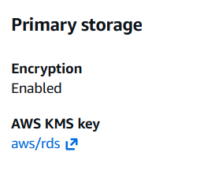
- Enabled encryption using AWS-managed KMS key (aws/rds) to reduce key management overhead since currently we have no compliance mandate to obey and we want rotation to be automatic. 

## Multi-AZs RDS in RDS
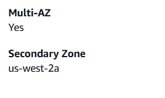
- Enabled Multi-AZ with RDS for automatic failover to a standby replica in a different Availability Zone in case of infrastructure failure without requiring manual intervention, therby ensuring high availability and minimizing downtime 

## Security Groups in RDS
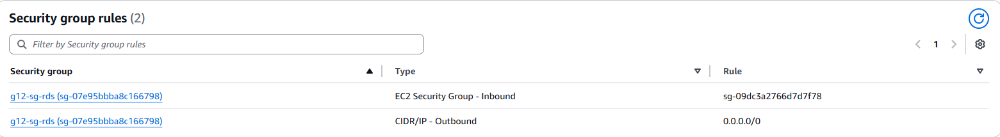
- Configured RDS security group to allow inbound traffic only from the ECS service security group on port 5432. This configuration enforces least privilege access and prevents unauthorized connections from external sources.

## Private subnets for RDS 
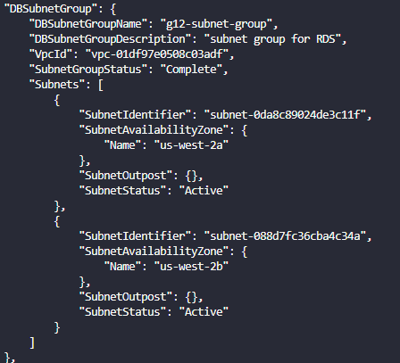
- RDS is placed in private subnets, which are different from subnets of ECS cluster, to seperate tiers and prevent direct internet exposure.

## Backups database
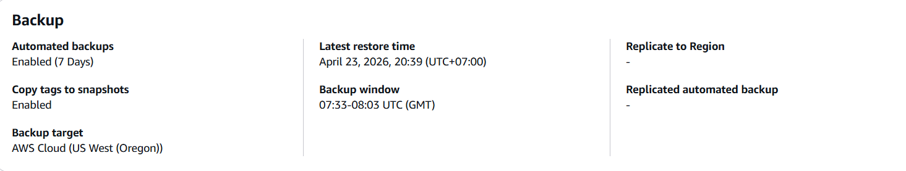
- Enabled automated backups with a 7-day retention period for point-in-time recovery. This configuration allows restoring the database to any specific timestamp within the retention window in case of data corruption

## Snapshot
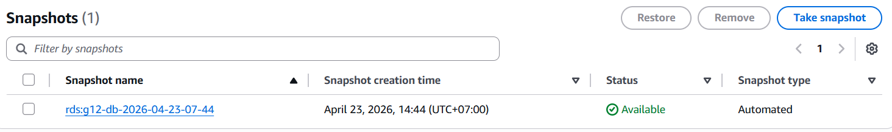
- Created a snapshots before any changes to provide a reliable rollback point, ensuring that we can quickly restore the database to a good state if deployment issues occur

## Instances and storages
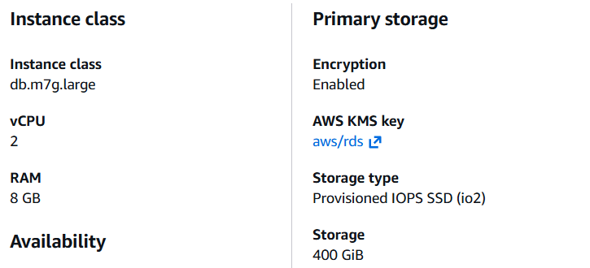
- Selected `db.m7g.large` instead of smaller instances like t3.micro to be able to handle expected workload and avoid CPU/memory bottlenecks when there are greate number of concurrent requests.
- Selected io2 over general-purpose SSD (gp3) to ensure predictable IOPS and durability for production workloads.

## Database subnet group
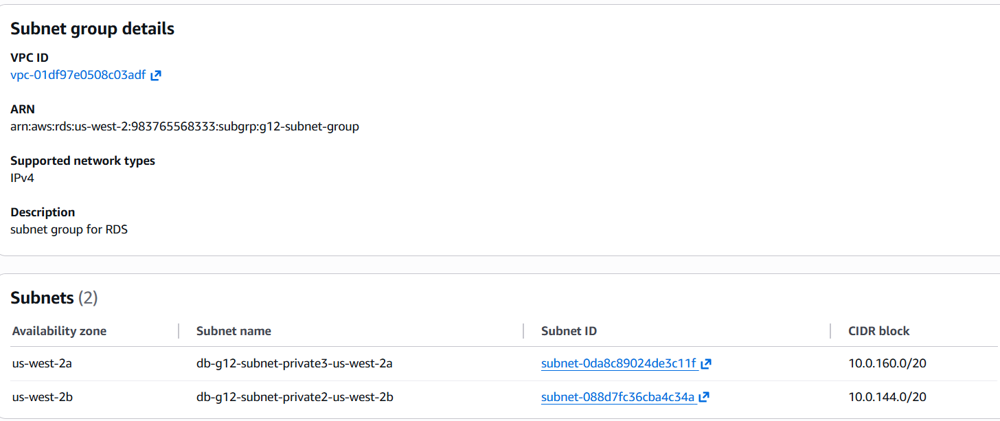
- Configured a DB subnet group with private subnets on two different Availability Zones, supporting Multi-AZ deployment for RDS to avoid single points of failure

## Disable public access
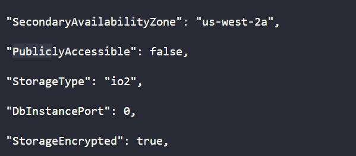
- Disabled public access for the RDS instance ensures that all database traffic flows only through ECS services, preventing unauthorized external connections


# 4. Working Query Evidence 
## JOIN operation
```sql
  SELECT a.*, j.title as job_title, j.company as job_company
  FROM applications a
  JOIN jobs j ON a.job_id = j.id
  ORDER BY a.submitted_at DESC
```
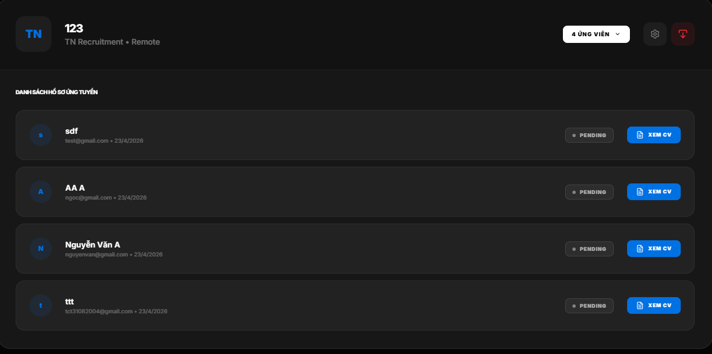
- The query returns application information along with job metadata and sorts results by `submitted_at DESC` by using JOIN operation. 

## Indexing
```sql 
  SELECT * FROM jobs 
  WHERE level = $1 
  ORDER BY created_at DESC;
```
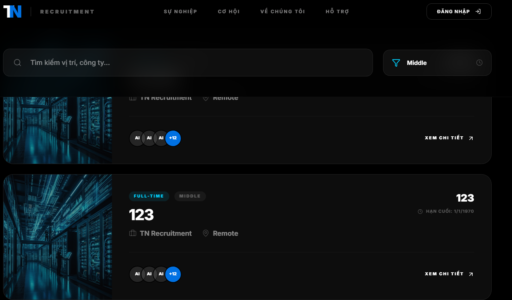
- Indexing on jobs.level can improve query performance with high filter speed.


# 5. Lambda, Textract and Comprehend Evidence 
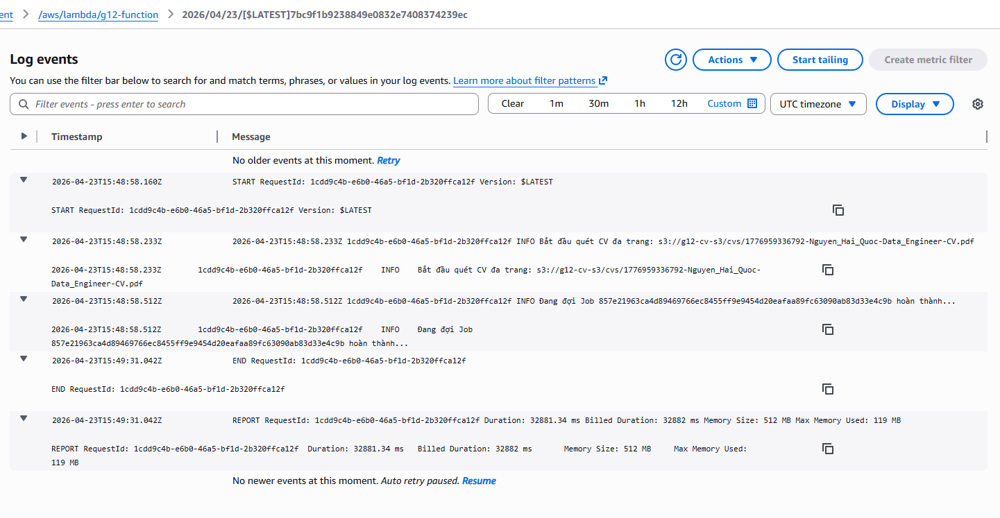

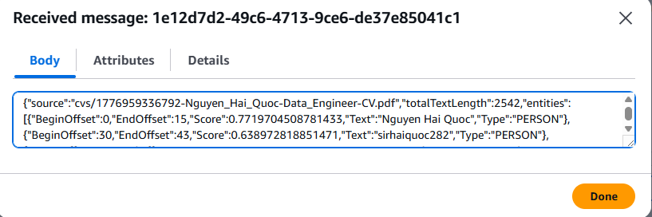
- After uploading CV into bucket through application, Lambda triggers event and get CV from bucket S3, send to Textract to get text, then Comprehend get information based on keywords and send result to SQS

# 6. VPC and Networking Evidence
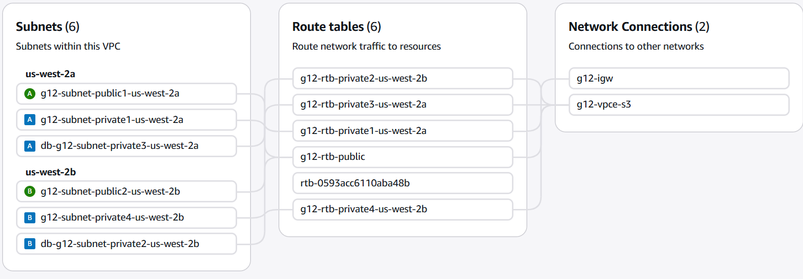
- Public subnets can access to the internet through internet gateway
- 4 private subnets can only access local services through local, and S3 through S3 gateway 


# 7. Negative Security Test
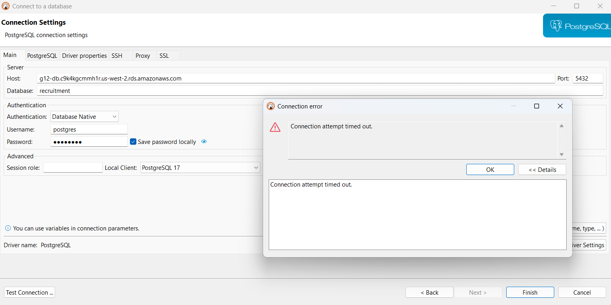
- Since PubliclyAccessible=false and the database is in private subnet of VPC, RDS is not exposed to the internet. External clients cannot connect to the database if they are not in the inbound rules of security group for RDS
  
